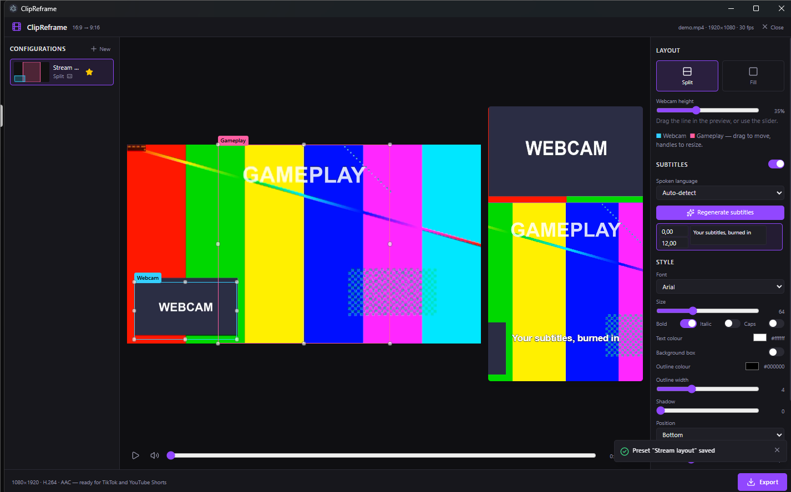

# ClipReframe

[](https://github.com/Istalry/ClipReframe/actions/workflows/ci.yml)
[](https://github.com/Istalry/ClipReframe/releases/latest)
[](LICENSE)

Turn a 16:9 gameplay + webcam clip into a 1080×1920 vertical video for TikTok and YouTube Shorts.
Everything runs offline on your PC — your videos never leave it.

See **[HOW-TO-USE.md](HOW-TO-USE.md)** for the user guide (**[version française](HOW-TO-USE.fr.md)**).



- Drag & drop a clip anywhere on the window, position the **webcam** and **gameplay** rectangles, watch the live 9:16 preview.
- Two layouts: **Split** (webcam on top, gameplay below, adjustable ratio) and **Fill** (one 9:16 crop).
- Save configurations, mark one as default (auto-applied on every new clip), delete the ones you no longer use.
- Optional subtitles: offline speech-to-text (whisper.cpp `small` model, language auto-detected or fixed), automatic clean-up
  of Whisper hallucinations, editable cues, fully styled (font, size, colours, outline, box, position), current-word
  highlight (box / text colour / outline colour) and burned in.
- Multi-track recordings (OBS mic / Discord / game): pick which tracks feed the subtitles and which are mixed into the export.
- Optional call-to-action outro (drop or pick a vertical video) appended to every export.
- Export: single MP4 — H.264 High, yuv420p, AAC 48 kHz, `+faststart` — valid for both platforms; encoded on the GPU
  (NVENC / AMF / Quick Sync) when one works, x264 CRF 17 otherwise.

Ships as a single portable Windows `.exe`; nothing to install.

## Download

Grab `ClipReframe-<version>-portable.exe` from the
[latest release](https://github.com/Istalry/ClipReframe/releases/latest) and run it. On first launch
it extracts its bundled ffmpeg / whisper runtime into `%TEMP%\ClipReframe` (kept between runs,
safe to delete).

The executable is **not code-signed** (certificates cost money), so Windows SmartScreen shows
"Windows protected your PC" the first time: click **More info → Run anyway**. You can verify what
you run by building it yourself with `build.bat` — the release workflow does exactly that.

## Requirements

- Windows 10/11 x64
- Node 22.12+ and pnpm (development only)

## Development

```bash
pnpm install
pnpm fetch-binaries     # downloads ffmpeg, ffprobe, whisper-cli and the whisper model (~700 MB, once)
pnpm dev -- --watch     # app with hot reload; main-process changes restart Electron
pnpm check              # lint + typecheck + tests
```

The default model is `small` (best accuracy/speed trade-off on CPU). `WHISPER_MODEL=medium pnpm fetch-binaries`
swaps in the larger model (1.5 GB, ~3x slower, marginally better); `base` is faster but noticeably worse in French.
The app picks the largest `ggml-*.bin` present in `resources/bin`.

> If Electron starts as plain Node (errors like "does not provide an export named 'BrowserWindow'"),
> unset `ELECTRON_RUN_AS_NODE` in your shell first — some IDE terminals set it.

## Build the portable executable

```bash
pnpm dist          # or double-click build.bat (installs, fetches binaries, runs checks, packages)
```

`build.bat --skip-check` skips lint/typecheck/tests.

Produces `release/ClipReframe-<version>-portable.exe` (~600 MB with the `small` model). Copy that one
file anywhere and run it. The bundled binaries are extracted into `%TEMP%\ClipReframe` on first
launch (kept between runs).

## Limitations

- Windows x64 only.
- Speech recognition runs on the CPU (no GPU whisper build yet). Video encoding uses the GPU
  when available, x264 otherwise.
- Preview playback relies on Chromium decoders: H.264 / VP9 / AV1 play; some HEVC or 10-bit sources
  will not preview (export still works). No proxy transcoding yet.
- The whole clip is exported; no in-app trimming.
- Subtitle preview is a CSS approximation of libass; the burned-in result can differ marginally.
- The in-app player plays the file's default audio track only; the track selection applies to the
  export and to speech recognition.

## Project layout

See [CLAUDE.md](CLAUDE.md) for the architecture, coding standards and contribution rules.

```
src/shared/    pure logic (geometry, ffmpeg graph, subtitles, presets, IPC contract) — unit-tested
src/main/      Electron main: services (ffmpeg, whisper, presets store), IPC handlers, media protocol
src/preload/   typed contextBridge
src/renderer/  React UI (Zustand stores, components, hooks)
scripts/       fetch-binaries.mjs
resources/     app icon; resources/bin/ holds the downloaded binaries (git-ignored)
```

## Presets location

`%APPDATA%\ClipReframe\presets.json`. A corrupt file is backed up next to it and reset.

## Contributing

See [CONTRIBUTING.md](CONTRIBUTING.md). Bug reports and feature requests go through
[GitHub issues](https://github.com/Istalry/ClipReframe/issues); security reports through
[SECURITY.md](SECURITY.md).

## Licence

ClipReframe is released under the [MIT licence](LICENSE).

The portable executable also bundles third-party software with its own licences — notably a
**GPL v3** FFmpeg build (BtbN) and whisper.cpp (MIT), run as separate processes. See
[THIRD-PARTY-NOTICES.md](THIRD-PARTY-NOTICES.md) for the full list, versions and source links.
